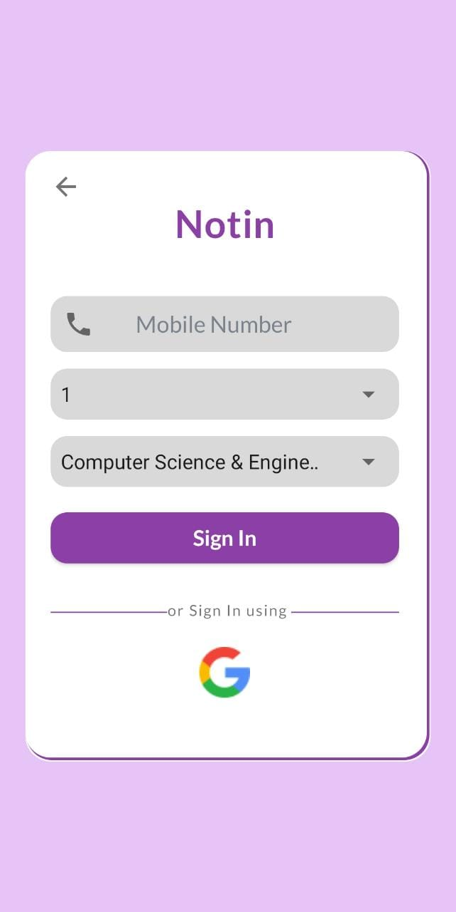
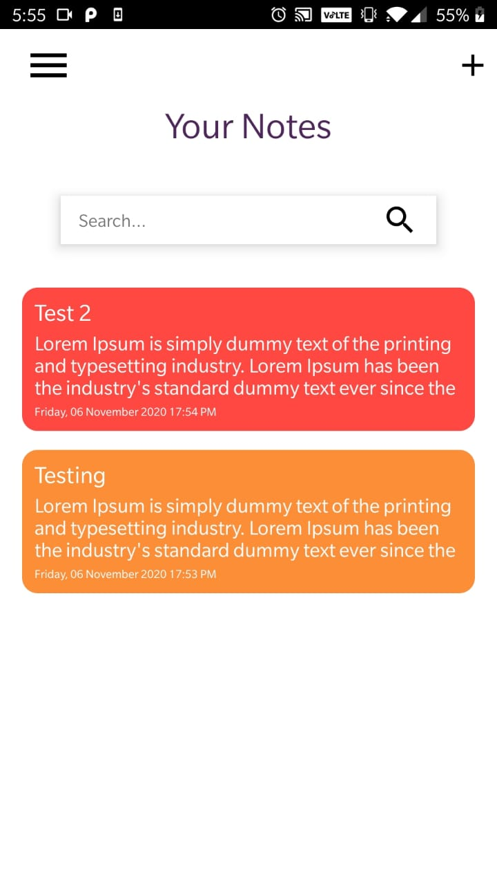
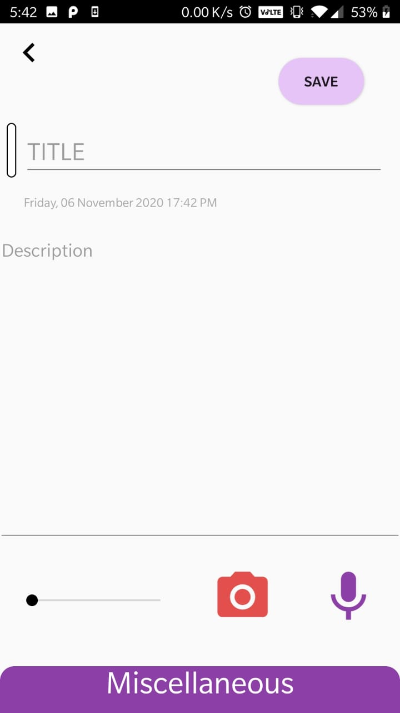
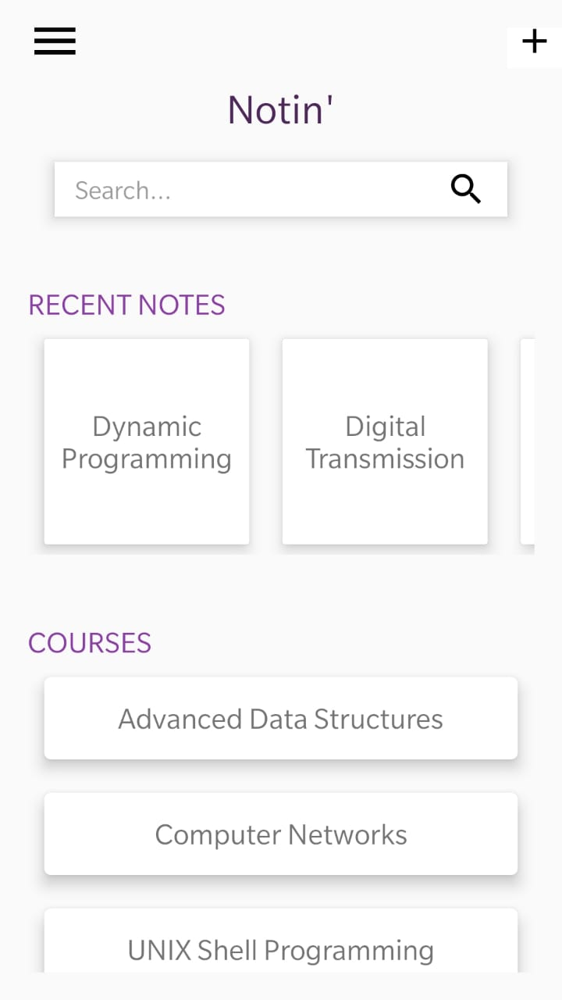
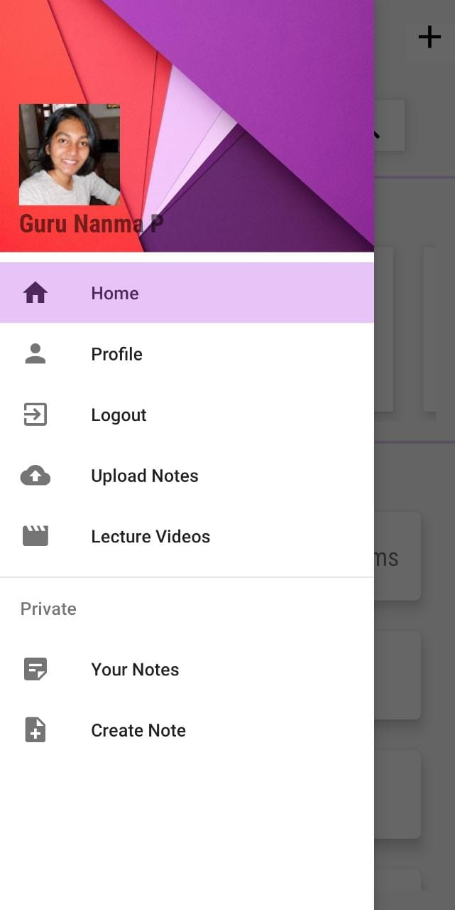
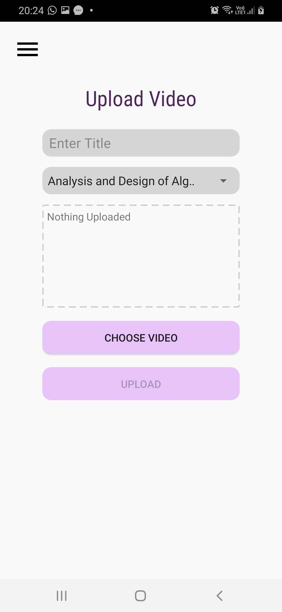

# Notin'

An app for sharing notes and reference materials as well as lecture videos.

### Features
<li>Create, view, upload and download notes and documents.</li>
<li>Speech to text conversion and Image text recognition to take down notes efficiently.</li>
<li>View Lecture videos uploaded by faculty.</li>

### Technologies
<li>Android Studio</li>
<li>Firebase</li>
<li>Room(local database)</li>

### Screen Shots

<table>
  <tr>
    <td>Splash Screen</td>
     <td>Onboarding Screen - Student</td>
    <td>Onboarding Screen - Teacher</td>

  </tr>
  <tr>
    <td></td>
    <td></td>
    <td></td>

  </tr>
 </table>

------------------------------------------------------------------------------------------------------------------
------------------------------------------------------------------------------------------------------------------

<table>
  <tr>
    <td>Login Screen</td>
    <td>Private Notes</td>
     <td>Create Notes</td>

  </tr>
  <tr>
     <td></td>
    <td></td>
    <td></td>

  </tr>
 </table>

 ------------------------------------------------------------------------------------------------------------------
------------------------------------------------------------------------------------------------------------------

<table>
  <tr>
    <td>Detext Text and Delete Image</td>
    <td>Course List View</td>
     <td>Notes List View and Download</td>

  </tr>
  <tr>
     <td></td>
    <td></td>
    <td></td>

  </tr>
 </table>

  ------------------------------------------------------------------------------------------------------------------
------------------------------------------------------------------------------------------------------------------

<table>
  <tr>
    <td>Lecture Videos</td>
    <td>PDF Viewer</td>
  </tr>
  <tr>
     <td></td>
    <td></td>

  </tr>
 </table>

  ------------------------------------------------------------------------------------------------------------------
------------------------------------------------------------------------------------------------------------------
<table>
  <tr>
     <td>Home Screen</td>
    <td>Navigation Menu</td>
  </tr>
  <tr>
  <td></td>
    <td></td>
  </tr>
 </table>

------------------------------------------------------------------------------------------------------------------
------------------------------------------------------------------------------------------------------------------
<table>
  <tr>
    <td>Upload Notes</td>
     <td>Update Profile</td>
    <td>Upload Videos</td>
  </tr>
  <tr>
    <td></td>
    <td></td>
    <td></td>
  </tr>
 </table>
